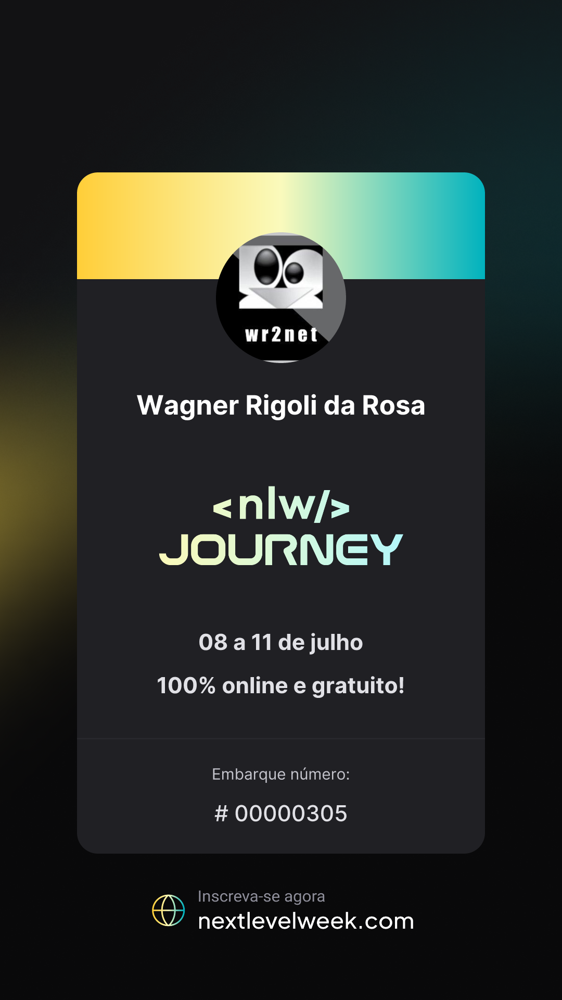

# NLW Journey

## Trilha NodeJs

<div style="text-align: center;">

</div>

### Install
```bash
npm install
```

### Run Server
```bash
tsx watch src/server.ts
```

### Create Tables 
```bash
npx prisma migrate dev
```
* Após a execução do comando acima, atribua um nome para a migração que está sendo executada.

### View Database
```bash
npx prisma studio
```
* Após a execução do comando acima, acesse o Prisma Studio através do endereço [http://localhost:5555](http://localhost:5555) 

## Routes

Base URL: http://localhost:3333

* Trips

| Name | Type | Endpoint | Body |
|--|--|--|--|
| Create Trips | POST | /trips | JSON |
| Confirm Trips | GET | /trips/tripId/confirm | NO BODY |
| List Trips | GET | /trips | NO BODY |

* Participants

| Name               | Type | Endpoint                            | Body    |
|--------------------|------|-------------------------------------|---------|
| Confirm Trips      | GET  | /participants/participantId/confirm | NO BODY |
| List Participants  | GET  | /participants/tripId                | NO BODY |
| Invite Participant | POST | /trips/tripId/invites               | JSON    |

* Activities

| Name            | Type | Endpoint                 | Body    |
|-----------------|------|--------------------------|---------|
| Create Activity | POST | /trips/tripId/activities | JSON    |
| List Activity   | GET  | /trips/tripId/activities | NO BODY |

* Links

| Name         | Type | Endpoint            | Body    |
|--------------|------|---------------------|---------|
| Create Links | POST | /trips/tripId/links | JSON    |
| List Links   | GET  | /trips/tripId/links | NO BODY |


* [Postman](Postman/README.md)
